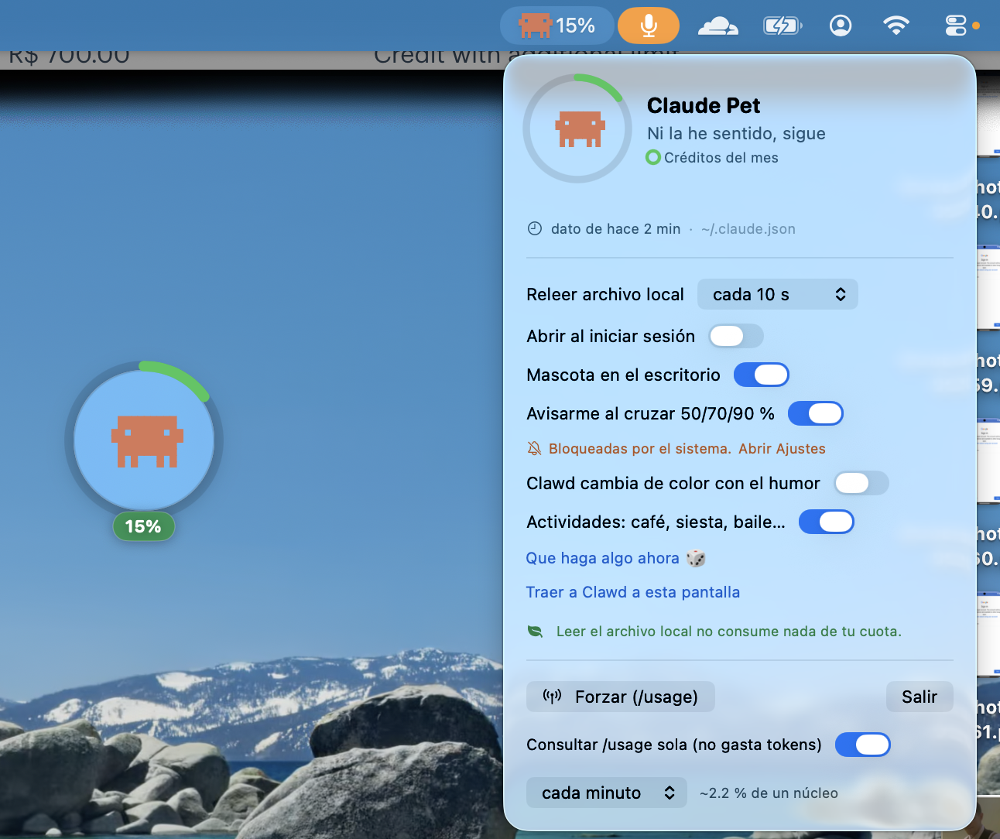

# 🦞 Claude Pet

**Clawd**, la mascota de Claude Code, vigilando tu consumo de cuota desde la barra de
menús y como bicho flotante en el escritorio. Cambia de cara según cuánto llevas gastado.



**No consume tu cuota**: lee los datos de archivos locales que Claude Code ya escribe en
tu máquina (`~/.claude.json` y `~/.claude/pet-usage.json`). Sin red.

## Instalar

### macOS

Con Claude Code, desde el repo:

```
/instalar-claude-pet
```

Detecta el sistema, compila/instala e instala el hook de `statusLine` si falta.

A mano:

```bash
./build.sh          # compila (basta con Command Line Tools, no hace falta Xcode)
open ClaudePet.app  # arranca
```

No hay binarios precompilados en el repo: `./build.sh` compila en tu máquina en segundos
y evita Gatekeeper por completo.

### Ubuntu

```bash
./install-linux.sh --user     # en ~/.local, sin sudo
```

**No hace falta root.** Claude Pet no necesita permisos de administrador ni para
instalarse ni para funcionar: todo lo que escribe está en tu HOME
(`~/.config/claudepet/`) y de `~/.claude.json` solo lee. El modo `--user` es igual de
completo —sale en el menú de aplicaciones con su icono, y arranca al iniciar sesión— y se
quita con `./install-linux.sh --user off`.

```bash
./install-linux.sh            # alternativa: .deb en /usr, gestionado por apt
```

Este segundo camino sí pide la contraseña una vez, y no por la app: es `apt`, que escribe
en `/usr` y en la base de datos de dpkg. Elígelo solo si quieres el paquete instalado para
todos los usuarios de la máquina o actualizarlo con `apt`. Los dos generan el `.deb` desde
el fuente y ofrecen instalar el hook de `statusLine`.
Versión en Python con applet de bandeja: ver [`linux/README.md`](linux/README.md). La app
de macOS no se puede portar (SwiftUI, AppKit y compañía son exclusivos de Darwin).
Las versiones de macOS y Linux avanzan por separado.

## El hook de `statusLine` (recomendado)

Si Clawd muestra `0/0 %`, falta el hook: `~/.claude.json` solo se actualiza cuando Claude
Code quiere (se ha medido una vez en 22 minutos), así que como fuente única no basta.

```bash
./install-statusline.sh    # configura el hook
./uninstall-statusline.sh  # revertirlo
```

Es gratis: Claude Code ejecuta un script local (`statusline-pet.py`), sin tokens ni red.
Hace copia de seguridad de `~/.claude/settings.json` y avisa si ya tenías otro `statusLine`.

**Reinicia Claude Code después de instalarlo.** El `statusLine` se lee al arrancar; hasta
entonces no se escribe `pet-usage.json` y seguirás viendo `0/0 %`.

Si pasan 15 minutos sin datos frescos (y Claude Code está corriendo), la app lo avisa: el
badge se pone gris con un ⏱ y el panel marca la antigüedad.

> **Si sigues en `0/0 %` con el hook instalado**, mira si ese proyecto tiene su propio
> `statusLine` en `.claude/settings.json` o `.claude/settings.local.json`: las settings
> del proyecto ganan sobre `~/.claude/settings.json`, que es donde escribe el instalador,
> y ahí el hook no llega a ejecutarse. `--dump` te lo dice desde el directorio en cuestión.

## Con Claude Code cerrado

El hook solo corre mientras hay una sesión abierta, así que al cerrar Claude Code la cifra
se congela. No es un fallo —con Claude Code cerrado tu cuota tampoco se mueve—, pero la
ventana sí avanza y el dato envejece.

Por eso, pasados 15 minutos sin dato fresco, Clawd pide `/usage` él solo. **No gasta
tokens** (ver más abajo) y no dispara mientras el hook esté alimentando el archivo: con
Claude Code abierto, cero procesos. Sale a ~0,1 % de un núcleo. Se apaga en el panel con
«Consultar /usage sola».

En Ubuntu funciona igual, con el mismo interruptor en el menú de la bandeja; ahí el coste
medido es ~0,98 s de CPU y ~400 MB de pico por consulta, que a una cada 15 minutos son
los mismos ~0,1 % de un núcleo.

## Permisos

Sin red, sin Automatización, sin Accesibilidad, sin acceso a archivos protegidos. Solo
lee dos archivos del home. Detalle en [INSTALAR.md](INSTALAR.md).

Lo único que puede preguntar:

- **Notificaciones**, una vez, y solo cuando haya algo que avisar (al cruzar el 50 %).
- **Ítems de inicio**, si activas «Abrir al iniciar sesión» (vía `SMAppService`, sin diálogo).

```bash
ClaudePet.app/Contents/MacOS/ClaudePet --dump   # diagnóstico: permisos, fuentes y cifras
```

## Uso

- **Barra de menús** → `😺 25%`. Clic abre el panel con las barras, los reinicios y los ajustes.
- **Mascota de escritorio** → arrástrala donde quieras; pasa el mouse para ver el detalle.
- **Clic sobre Clawd** → sonríe y relee el archivo.
- **Clic derecho** → ocultar del escritorio, actualizar ahora, disparar una actividad,
  apagar las actividades automáticas, traerla a esta pantalla, salir.
- **Notificaciones** al cruzar 50 %, 70 % y 90 %.

La mascota lleva dos anillos: el exterior es la semana (7 días) y el interior la sesión
(5 h). El badge muestra `sesión/semana`.

| Consumo | Anillo |
|---|---|
| < 40 % | verde |
| 40–70 % | amarillo |
| 70–90 % | naranja |
| ≥ 90 % | rojo |
| sin datos | gris |

Cada 45–150 s Clawd hace algo unos segundos (café, bostezo, baile, ejercicio, siesta,
manzana) y vuelve al reposo. Entre las 6 p.m. y las 6 a.m. lleva gorrito de dormir.

```bash
./ClaudePet.app/Contents/MacOS/ClaudePet --demo        # recorre las actividades en bucle
./ClaudePet.app/Contents/MacOS/ClaudePet --demo=nap    # fija una sola
```

### Planes Team y Enterprise

Se miden en dinero, no en porcentaje. La app dibuja todas las dimensiones que encuentre
(gasto, créditos, ventanas del plan) y calcula el humor sobre la peor de todas. Si la
sesión no usa una suscripción de Claude.ai (API key, Bedrock, Vertex) no hay límites que
mostrar y la app lo dice.

En esos planes no hay ninguna fuente que se refresque sola —ni siquiera con Claude Code
abierto, porque no publican `rate_limits`—, así que `/usage` no es el plan B sino el único.
**No gasta tokens**, medido con `--output-format json`: `num_turns` 0, `total_cost_usd` 0.
Lo que cuesta es arrancar el CLI (~1,3 s de CPU y un pico de 580 MB), así que aquí sí se
elige el intervalo en el panel, con un mínimo de un minuto:

| Intervalo | Coste |
|---|---|
| cada minuto | ~2,2 % de un núcleo |
| cada 2 min | ~1,1 % |
| cada 5 min (por defecto) | ~0,4 % |

En Pro/Max el selector no aparece: allí solo dispara con el dato viejo, así que el
intervalo lo fija ese umbral de 15 minutos. Se puede apagar en los dos casos.

Para probar con datos de otro plan sin tocar los tuyos:

```bash
CLAUDEPET_JSON=/ruta/a/otro.json CLAUDEPET_STATUSLINE_JSON=/nope \
  ClaudePet.app/Contents/MacOS/ClaudePet --dump
```

## Estructura

```
Sources/main.swift       todo el código de macOS (modelo, lectura local, UI, ventana flotante)
build.sh                 compila y empaqueta ClaudePet.app
package.sh               genera el .zip para compartir
statusline-pet.py        hook opcional de statusLine
install-statusline.sh    instala/revierte el hook
uninstall-statusline.sh
start-at-login.sh        arrancar al iniciar sesión (--off para quitarlo)
linux/                   versión para Ubuntu (Python) y su paquete .deb
```
