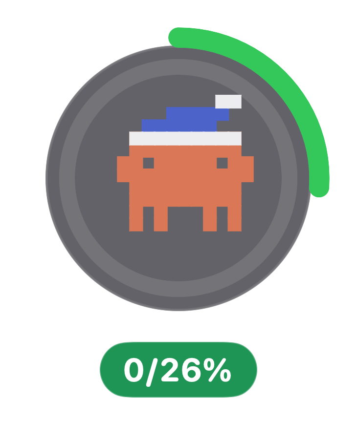

# Mascota flotante en Ubuntu — encargo para un agente

Instrucciones completas para implementar en **este mismo repo** el equivalente Linux de
la mascota de escritorio de macOS. Todo lo que hace falta está aquí: no hay que leer
Swift para entenderlo, aunque el fuente de macOS sirve de referencia visual.

## Qué hay que construir



Una ventana pequeña, sin marco, siempre visible por encima del escritorio, arrastrable,
con fondo transparente. Dentro:

1. **El plato** — círculo gris translúcido con un borde tenue.
2. **Dos anillos concéntricos** — el exterior es la semana, el interior la sesión. Van
   coloreados según el humor y arrancan a las 12 en punto, en sentido horario.
3. **Clawd** — el sprite pixel-art de 11 × 8, centrado dentro del anillo interior. Entre
   las 6 p.m. y las 6 a.m. lleva gorrito de dormir (es lo que se ve en la imagen).
4. **El badge** — cápsula del color profundo del humor con `sesión/semana %` en blanco.

El PNG de arriba se generó con el código real de macOS, así que **es la referencia
exacta**: colores, proporciones y posiciones deben coincidir con él.

---

## Punto de partida: lo que YA existe y no hay que reescribir

Todo vive en `linux/claudepet/`. El motor de datos está probado contra datos reales;
reutilízalo tal cual.

### `usage.py` — lectura y fusión de las dos fuentes locales

```python
from claudepet import usage

data = usage.best()            # -> Usage | None   (fusiona ~/.claude.json + statusLine)
usage.empty_reason()           # -> str, explicación cuando best() da None
usage.claude_code_active()     # -> bool, ¿Claude Code tocó algún archivo hace <3 min?
usage.mood_for(pct)            # -> "chill" | "ok" | "alert" | "panic"
usage.MOOD_COLORS[mood]        # -> (relleno, profundo) en 0xRRGGBB
usage.CLAUDE_JSON, usage.STATUSLINE_JSON   # rutas que hay que vigilar por mtime
```

`Usage` expone: `session_pct`, `week_pct`, `worst`, `age`, `is_stale`, `source`,
`session`, `weekly`, `others` (lista de `Limit`), y cada `Limit` tiene
`label`, `percent`, `detail`, `resets_at`.

**Regla de oro: leer es gratis y no consume cuota.** No llames nunca a `claude -p`.

### `sprite.py` — la rejilla de Clawd

```python
sprite.BODY, sprite.CAP_BODY, sprite.CAP_TRIM   # rejillas "#"/"." 
sprite.EYE_COLS, sprite.ARM_ROWS
sprite.BRAND        # 0xD97757
sprite.CAP_COLOR    # 0x4C63C9   sprite.CAP_TRIM_COLOR  # 0xEDEDF0
sprite.body_grid(eyes="open"|"closed"|"wide"|"happy", mouth=0..4)  # -> list[list[bool]]
sprite.render(...)  # PNG para la bandeja; NO sirve para la ventana, ahí se dibuja con Cairo
```

Para la ventana flotante **no uses `sprite.render()`**: dibuja las celdas directamente
con Cairo (rectángulos llenos), que escala sin interpolar y permite mover bracitos.

### `tray.py` — patrones que conviene copiar

- Sondeo por `mtime` cada 5 s (`GLib.timeout_add_seconds`), y solo re-parsear si cambió.
- Detección de noche (`_is_night()`: hora ≥ 18 o < 6).
- Formato de antigüedad (`_ago()`).
- Carga tolerante del indicador (Ayatana o el nombre viejo).

### Referencia visual: el fuente de macOS

Solo para consultar números y comportamiento, **no se toca**:

| Qué | Dónde |
|---|---|
| Ventana flotante y menú contextual | `Sources/main.swift` → `DesktopPetView` |
| Plato + anillos + sprite | `MascotView` |
| El anillo | `ProgressRing` |
| Sprite animado, gorrito, actividades | `ClawdView` |

---

## Especificación visual (números sacados del código de macOS)

Con `size = 96` px de lado para el conjunto plato+anillos:

| Elemento | Valor |
|---|---|
| Lado del conjunto | `size = 96` |
| Plato | círculo con `padding = size * 0.028` (≈ 2.7 px), gris `#59595E` al 94 %, borde blanco 13 % de 0.6 px |
| Anillo exterior (semana) | grosor `size * 0.072` ≈ 6.9 px, pegado al borde |
| Anillo interior (sesión) | grosor `size * 0.056` ≈ 5.4 px, con `inset = size * 0.105` ≈ 10.1 px |
| Pista de los anillos | blanco al 13 % |
| Arco de progreso | color de relleno del humor, extremos redondeados (`round cap`), empieza a −90° |
| Ancho de Clawd | `size * 0.48` ≈ 46 px → **celda = ancho / 11 ≈ 4.2 px** |
| Texto del badge | 11 px, negrita, palo seco redondeado |
| Cápsula | relleno = color profundo del humor, borde blanco 28 % de 0.5 px, padding 8 × 2.5 px |
| Separación plato → badge | ≈ 3 px |

Colores de humor (`usage.MOOD_COLORS`, ya son los mismos que macOS):

| Humor | Umbral | Relleno | Profundo (badge) |
|---|---|---|---|
| chill | < 40 % | `#34C759` | `#1E9455` |
| ok | < 70 % | `#FFB020` | `#B07A06` |
| alert | < 90 % | `#FF8A2B` | `#C4551C` |
| panic | ≥ 90 % | `#FF4D4D` | `#C42B2B` |
| broken | sin datos / viejo | `#98989D` | `#6E6E73` |

El humor sale de `data.worst` (el **peor** límite, no solo sesión y semana).

---

## Cómo montar la ventana en GTK 3

Archivo nuevo: `linux/claudepet/pet.py`. Ni una dependencia nueva de pip — PyGObject y
Cairo, que ya vienen del sistema.

```python
import gi
gi.require_version("Gtk", "3.0")
from gi.repository import Gdk, GLib, Gtk

class PetWindow(Gtk.Window):
    def __init__(self):
        super().__init__(type=Gtk.WindowType.TOPLEVEL)
        self.set_app_paintable(True)          # dibujamos nosotros el fondo
        self.set_decorated(False)             # sin marco ni barra de título
        self.set_keep_above(True)             # siempre encima
        self.set_skip_taskbar_hint(True)      # no sale en el conmutador de ventanas
        self.set_skip_pager_hint(True)
        self.stick()                          # visible en todos los escritorios
        self.set_type_hint(Gdk.WindowTypeHint.UTILITY)
        self.set_default_size(140, 150)

        screen = self.get_screen()            # transparencia real
        visual = screen.get_rgba_visual()
        if visual is not None:
            self.set_visual(visual)

        self.add_events(Gdk.EventMask.BUTTON_PRESS_MASK
                        | Gdk.EventMask.POINTER_MOTION_MASK
                        | Gdk.EventMask.ENTER_NOTIFY_MASK
                        | Gdk.EventMask.LEAVE_NOTIFY_MASK)
        self.connect("draw", self.on_draw)
        self.connect("button-press-event", self.on_click)
```

Si `get_rgba_visual()` devuelve `None` no hay compositor: dibuja entonces el fondo con
un color sólido en vez de transparente, y déjalo dicho en el README.

### El dibujo, aislado y comprobable

La función que pinta **no debe depender de la ventana**. Firma obligatoria:

```python
def draw_pet(cr, data, night, size=96, stale=False):
    """Dibuja plato + anillos + Clawd + badge en el contexto Cairo `cr`."""
```

Así se puede volcar a PNG sin pantalla ninguna, que es como vas a comprobar el
resultado (ver más abajo). Piezas:

- **Arco**: `cr.arc(cx, cy, radio, -pi/2, -pi/2 + 2*pi*pct/100)` con
  `cr.set_line_cap(cairo.LINE_CAP_ROUND)`.
- **Sprite**: recorre `sprite.body_grid(...)`; por cada celda encendida un
  `cr.rectangle(x, y, celda + 0.5, celda + 0.5)`. El `+0.5` evita costuras finas entre
  celdas contiguas — está así en macOS por la misma razón. Los bracitos son dos celdas
  sueltas en las columnas 0 y 10, filas 2 y 3.
- **Gorrito**: `CAP_BODY` y `CAP_TRIM` tres filas por encima del cuerpo.
- **Texto**: `cr.select_font_face(...)` + `cr.show_text(f"{sesión}/{semana}%")`, centrado
  midiendo con `cr.text_extents()`.

---

## Comportamiento

| Gesto | Qué hace |
|---|---|
| Arrastrar | mueve la mascota; usa `self.begin_move_drag(...)` con los datos del evento |
| Clic izquierdo | saluda: ojos `happy`, boca `4`, un saltito y un bocadillo 2,8 s; de paso relee el archivo (gratis) |
| Pasar el ratón | tooltip con sesión, semana y antigüedad del dato |
| Clic derecho | menú (`Gtk.Menu.popup_at_pointer`) |

Menú, en este orden — el primero es el que más se busca:

```
Ocultar del escritorio        → esconde la ventana, la bandeja sigue
Actualizar ahora              → relee los archivos locales
Traer a esta pantalla         → recoloca si se perdió en otro monitor
─────────
Salir de Claude Pet
```

Otros detalles que tiene la de macOS y hay que respetar:

- **Dato viejo**: si `data.is_stale` **y** `usage.claude_code_active()`, el badge pasa a
  gris (`broken`) con un ⏱ delante. Si Claude Code no está corriendo, no se avisa: la
  cuota no se mueve y el aviso sería ruido.
- **Sin datos**: badge gris y tooltip con `usage.empty_reason()`.
- **Noche**: gorrito entre las 18:00 y las 6:00.
- **Refresco**: `GLib.timeout_add_seconds(5, ...)` mirando el `mtime` de los dos
  archivos; solo re-dibuja si cambió algo.

---

## Persistencia

`~/.config/claudepet/state.json`:

```json
{ "pet_visible": true, "x": 1640, "y": 820 }
```

Se escribe al soltar la ventana (`configure-event`, con un pequeño *debounce*) y al
salir. Al arrancar, si no hay posición guardada o cae fuera de toda pantalla conectada,
colócala **abajo a la derecha del monitor principal, a 24 px del borde** — igual que macOS.

---

## Integración con lo que ya hay

1. **`__main__.py`** — nuevo flag:
   ```
   --pet          arranca solo la mascota flotante (sin bandeja)
   --no-pet       arranca solo la bandeja
   sin argumentos bandeja + mascota, según state.json
   ```
   Sigue el patrón existente: `--dump` y `--icon` **no importan GTK**, no lo rompas.
2. **`tray.py`** — añade al menú un `Gtk.CheckMenuItem` «Mascota en el escritorio» que
   muestre y esconda la ventana. Bandeja y mascota comparten un solo `Gtk.main()` y una
   sola lectura de datos: no montes dos temporizadores.
3. **`build-deb.py`** — los `.py` nuevos se empaquetan solos (recorre el directorio),
   pero hay que **añadir `python3-gi-cairo` a `Depends`**: sin él PyGObject no expone
   Cairo y la ventana no pinta nada. Sube `VERSION` a `1.1`.
4. **`linux/README.md`** — documenta el flag nuevo y la advertencia de Wayland.

---

## Wayland: el punto donde esto se puede torcer

Ubuntu 22.04+ arranca GNOME sobre Wayland por defecto, y ahí **una aplicación no puede
colocarse sola en la pantalla**: `Gtk.Window.move()` se ignora, así que la posición
guardada no se puede restaurar. Lo que sí funciona en Wayland: la transparencia,
mantenerse encima (parcialmente) y arrastrar con `begin_move_drag()`, que lo hace el
compositor.

Qué hacer:

- Detecta el backend: `Gdk.Display.get_default().get_name()` o
  `os.environ.get("XDG_SESSION_TYPE")`.
- En X11, comportamiento completo (`move()` + posición guardada).
- En Wayland, sáltate el `move()` sin quejarte, guarda la posición igual (por si la
  siguiente sesión es X11) y deja constancia en el README y en `--dump`.
- No metas `gtk-layer-shell`: es una dependencia más y **Mutter no implementa
  `wlr-layer-shell`**, así que en GNOME no arregla nada.

---

## Cómo comprobarlo sin tener el escritorio delante

Esto se escribe muchas veces desde un Mac. El truco es que `draw_pet()` no dependa de
la ventana, y añadir un flag oculto que la vuelque a PNG:

```bash
python3 -m claudepet --pet-png /tmp/pet.png --night   # usa cairo.ImageSurface, sin pantalla
```

Compáralo con `docs/mascota-flotante.png` de este repo. Debe coincidir en proporciones,
colores y posiciones. Eso valida todo el dibujo sin necesidad de GTK corriendo.

Después, en una máquina Ubuntu de verdad, en este orden:

```bash
python3 -m claudepet --dump      # 1. ¿los datos salen bien? (no necesita GTK)
python3 -m claudepet --pet       # 2. ¿aparece la ventana?
```

---

## Criterios de aceptación

- [ ] `python3 -m claudepet --pet-png out.png` genera una imagen igual a la de referencia.
- [ ] La ventana flota sin marco, con fondo transparente, y no aparece en el conmutador.
- [ ] Se arrastra, y en X11 vuelve al mismo sitio tras reiniciar.
- [ ] Clic derecho abre el menú; «Ocultar del escritorio» la esconde y la bandeja la
      devuelve.
- [ ] Los anillos y el badge cambian de color al cruzar 40 / 70 / 90 %.
- [ ] Gorrito entre las 18:00 y las 6:00.
- [ ] Badge gris con ⏱ solo cuando el dato es viejo **y** Claude Code está corriendo.
- [ ] `--dump` sigue funcionando sin GTK instalado.
- [ ] `python3 linux/build-deb.py` genera el `.deb` y este instala en Ubuntu limpio.

## Lo que NO hay que hacer

- **No tocar nada de macOS**: `Sources/`, `build.sh`, `install.sh`, `package.sh` se
  quedan como están. Este encargo es solo `linux/` y `docs/`.
- **Cero dependencias de pip** — ni Pillow, ni cairosvg, ni `pystray`. Librería estándar
  y lo que trae el sistema (`python3-gi`, `python3-gi-cairo`).
- **No llamar a `claude -p`** ni abrir ninguna conexión de red. La app lee dos archivos
  locales y nada más; ese es su argumento de venta.
- **No romper `--dump`**: tiene que seguir funcionando en una máquina sin escritorio.
